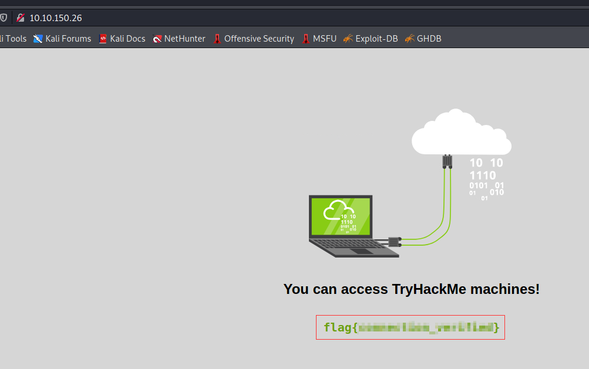

# 'Tutorial' Writeup

This looks like an introduction to the platform and how to get started.

## Task 1
The aim is to fire up a TryHackMe machine and successfully connect to it. I am connecting using a VPN. On connecting, we use the machine IP to open up the corresponding web page and get a flag

